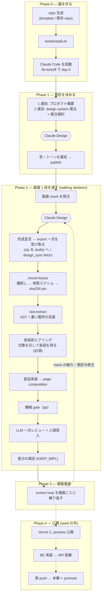

# claude-design-fe-starter

Mock-first frontend starter — the Claude Design mock is the single source of
truth, and a Playwright parity harness converges the implementation onto it.
Docs are in Japanese.

## 何を解決するか

意匠と実装は、レビューの見落としと小さな妥協でじわじわずれていく。目視で指摘し続けても、指摘の網羅性は人の集中力で決まる。

この seed は、承認した mock を凍結して意匠の正本にし、実装がそこへ収束したかを pixel と invariant で機械判定する。ずれは gate が落とすので、人の目は「mock 自体が正しいか」だけに使える。前提はモバイルファースト。

現状: 実プロジェクト 1 件で「mock を作る → 実装する」の一周を通し、gate が skip 無しで緑になるところまで到達している。「mock を更新して実装へ反映する」向きは未実証（`todos.md`）。seed 自身は凍結 mock を持たないので、この repo を clone しただけでは mock 側の gate は skip になる。

## クイックスタート

新規プロジェクト:

1. GitHub の「Use this template」で repo を生成する
2. Claude Code で `/fe-kickoff` を実行する
3. 最初の 1 画面で mock → 凍結 → 実装 → gate を一周させてから画面を増やす

既存 repo への後付け（**既に動いている実装があるなら、先に `seed-docs/adoption.md` §1 を読む** — main を凍結したまま作り替えるため、install の前に branch を切る）:

```bash
git switch -c fe-rebuild
git clone https://github.com/h2suzuki/claude-design-fe-starter /tmp/fe-seed
/tmp/fe-seed/tools/install.sh
```

対象 dir は省略すると cwd。PJ が手を入れた file は残して末尾に列挙する。`--depth 1` では clone しない — installer は seed の履歴を辿って「過去に配った版」を衝突から外すので、履歴が無いと 2 回目以降に触っていない file まで衝突扱いになる。

## 仕組み

repo を作ってから本番に出すまで。seed が覆うのは **Phase 0〜3** で、Phase 4（公開・BE 配線）は道具も手順も持っていない。



day-0 に整えることと一周の完了条件は `seed-docs/walking-skeleton.md`、画面ごとの繰り返しは `seed-docs/screen-loop.md`。

## リポジトリ構成

```text
├── CLAUDE.md            mock-first 行動規範（数行・outcome 原則のみ）
├── SEED-CONTRACT.md     seed が所有する dir と配る file の契約
├── .claude/             project skills 4 本 + 機械判定 hook 3 本
├── docs/                設計リファレンス 6 本
│   └── presentation/    mock 凍結置き場（export + sha256 台帳 + KEEP_IMPL 台帳）と UI AST 置き場
├── frontend/            SvelteKit skeleton
├── pp/                  parity harness（dump / diff / sweep / self-baseline / provenance）
├── seed-docs/           プロセス文書 6 本
└── tools/               ast-tree・ast-viewer・ast_validate・design_sync・install.sh・toolchain-dir
```

`docs/` `tools/` `.claude/` は seed と PJ の file が同居する merge 領域、それ以外は seed の占有 dir（`SEED-CONTRACT.md`）。

## ドキュメント

| 知りたいこと | 文書 |
|---|---|
| day-0 に整えることと一周の完了条件 | `seed-docs/walking-skeleton.md` |
| 既存 repo へ入れて main へ land するまで | `seed-docs/adoption.md` |
| 画面を 1 枚追加する定常手順 | `seed-docs/screen-loop.md` |
| Claude Design への発注文と規約 | `seed-docs/first-prompts.md`・`seed-docs/design-order-template.md` |
| 実装前にユーザーへ確認すること | `seed-docs/pre-implementation-questions.md` |
| 完成条件・基準 viewport・DoD | `docs/ui-quality-policy.md` |
| mock と実装の同期、書き戻し | `docs/design-sync.md` |
| pixel 一致の作り方と落とし穴 | `docs/pixel-perfect.md`・`docs/ui-caveats.md` |
| UI AST の位置づけと schema | `docs/ast-layer.md` |
| 構成要素・版・依存宣言・制約 | `docs/stack.md` |
| gate の一覧と回し方 | `pp/README.md` |
| mock の凍結手順 | `docs/presentation/ui-mock/README.md` |
| seed が何を所有し何を配るか | `SEED-CONTRACT.md` |

## 前提

| 対象 | 要件 |
|---|---|
| Node | `^20.19 \|\| ^22.12 \|\| >=24`（依存の `engines` から。`docs/stack.md`） |
| bun | 依存導入と script 実行に使う。版は固定しない |
| Playwright の browser | gate に要る。`tools/toolchain-dir` が決める置き場へ取得する（`seed-docs/walking-skeleton.md`） |
| Claude Code | Phase 0 から要る。`install.sh` の直後に `/fe-kickoff` |
| Claude Design | design system 用と mock 用の 2 project |

## License

MIT
