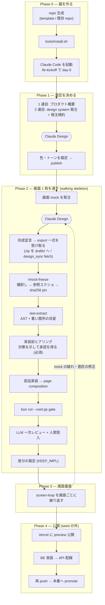
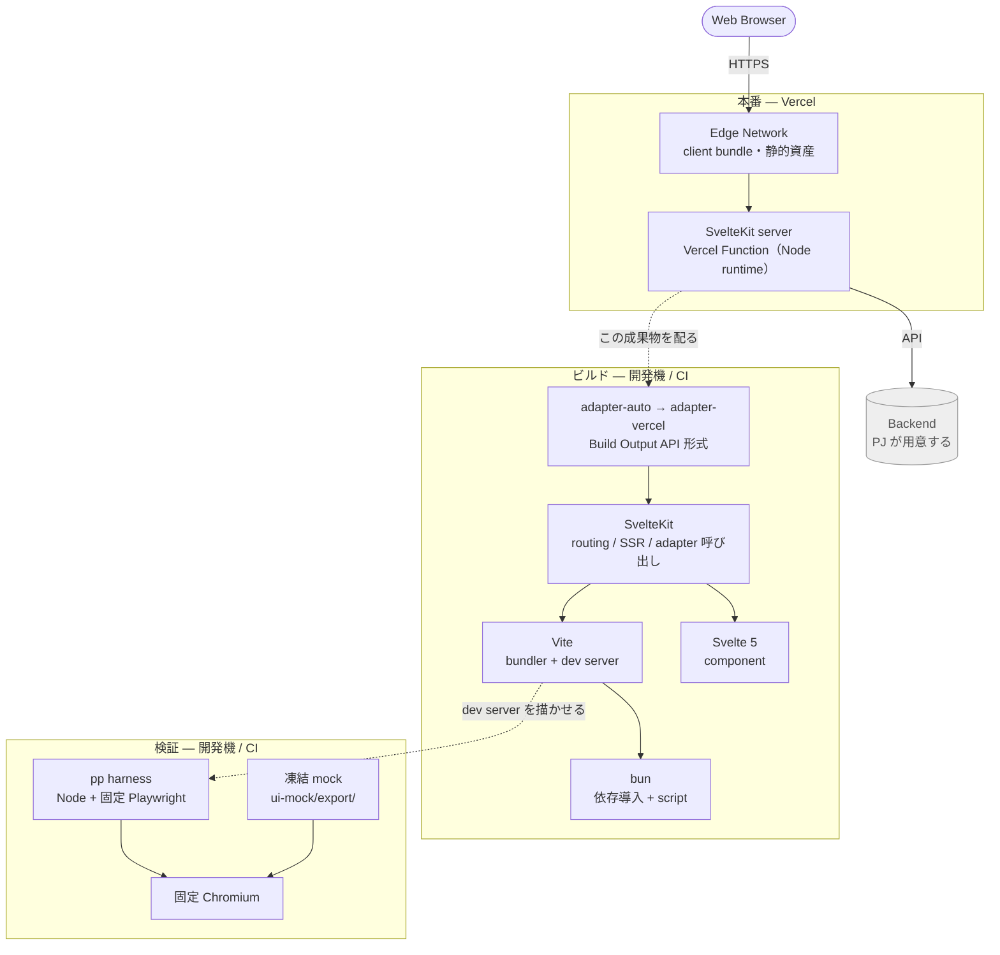

# claude-design-fe-starter

Mock-first frontend starter — the Claude Design mock is the single source of
truth, and a Playwright parity harness converges the implementation onto it.
Docs are in Japanese.

意匠と実装がじわじわずれていく問題を、**目視の指摘ではなく機械 gate で閉じる**ための seed。
ずれは gate が落とすので、人が見るのは「mock 自体が正しいか」に絞れる。

## これは何

Claude Design の mock を意匠の唯一の正本（SSOT）とし、

1. mock を作って承認 → export 凍結 + sha256 pin
2. 部品先行で実装（tokens → components → 薄い page composition）
3. 機械 gate（structural parity・幅スイープ・状態スイープ・スクショ自己回帰・出所照合）で mock へ収束
4. LLM スクショ一次レビュー + 人間受入を機械 gate と別立てで常設

という順序を day-0 から強制する。前提はモバイルファースト。

## 使い方

新規プロジェクト（基本形）:

1. GitHub の「Use this template」で repo を生成する
2. Claude Code で `/fe-kickoff` を実行し、day-0 セットアップ（`seed-docs/walking-skeleton.md`）を進める
3. 最初の 1 部品で mock → 凍結 → 実装 → parity → sweep を一周させてから画面量産に入る

既存 repo への後付け導入（BE 先行 repo 等）:

```bash
git clone --depth 1 https://github.com/h2suzuki/claude-design-fe-starter /tmp/fe-seed
/tmp/fe-seed/tools/install.sh
```

対象 dir は相対パスでよく、省略すると cwd になる。前回 install のまま触られていないファイルは黙って新版へ入れ替わり、**PJ が手を入れたファイル**（`pp/src/config.ts` などの差し替え点）はそのまま残して末尾に列挙する。まだ seed が入っていない repo で衝突したときだけ、対象違いを疑って何も書かずに停止する（置き換えたい場合は `--overwrite`）。最後に、まだ commit されていない seed の path をまとめて commit するか 1 キーで聞く（`y` / `Y` だけが進み、他のキーは即 cancel。`--commit` / `--no-commit` で固定でき、cancel しても再実行で同じ確認に戻る）。詳細は `SEED-CONTRACT.md`。

既に動いている実装がある repo（BE 先行・旧 FE あり等）は、導入後にまず `seed-docs/adoption.md` を読む（worktree で main を凍結したまま作り替える手順・既存実装を参照資料として扱う規律・段階移行の順序）。

導入後はそのまま `/fe-kickoff` で day-0 を進める（project skills は自動 hot-reload される。認識されないときは `/reload-skills`、hooks 登録を含む settings の変更が効かないときのみ再起動）。`.claude/settings.json` が既存だった場合は、hooks の手動 merge を先に行う（installer が NOTE で知らせる）。

## 全体の流れ

repo を作ってから本番に出すまで。seed が覆うのは **Phase 0〜3** で、Phase 4（公開・BE 配線）は道具も手順も持っていない。



### 各段で何が起きるか

| # | 段 | 誰が動かすか | 入力 | 出力 | 次へ進む条件 |
|---|---|---|---|---|---|
| 0-1 | repo 生成 | 人 | — | 空の repo | — |
| 0-2 | `tools/install.sh` | 人 or Claude Code | seed の checkout | seed 一式が repo に入る | 既存 repo なら `seed-docs/adoption.md` を先に読む |
| 0-3 | `/fe-kickoff` | Claude Code | — | 差し替え点が埋まった状態 | `{{...}}` の残りがゼロ |
| 1-1 | 1 通目・2 通目を渡す | 人 | `seed-docs/first-prompts.md` + `design-order-template.md` の規約 block | design system | 人が色・トーンを裁定 |
| 1-2 | publish | 人 | 承認した design system | org の新規 project へ自動適用 | — |
| 2-1 | 画面 mock を発注 | 人 | 要件 + 規約 block | 画面 mock | 人の完成宣言 |
| 2-2 | export を受け取る | 人 → Claude Code | zip を `drafts/` へ、または `tools/design_sync fetch` | 取得物 | 取得が切れていないこと（`lint:mock` の MOCK103） |
| 2-3 | `/mock-freeze` | Claude Code | 取得物 | `docs/presentation/ui-mock/export/` + `mock-baseline.sha256` + 参照スクショ | `test:provenance` が緑 |
| 2-4 | `/ast-extract` | Claude Code | 凍結 export | `docs/presentation/ui-ast/screens/<slug>.ui-ast.json` | `tools/ast_validate` が緑 |
| 2-5 | **実装前ヒアリング** | Claude Code → 人 | MOCK104 の一覧 + mock を読んだ所見 | 対策とその**承認** | **承認が取れるまで実装に入らない** |
| 2-6 | 部品実装 → 合成 | Claude Code | AST + 承認済みの対策 | `frontend/src/lib/ui/` と `routes/` | states fixture が揃う |
| 2-7 | 機械 gate | Claude Code | 実装 + 凍結 mock | 判定 | **skip ゼロで全緑**（skip は未検証であって合格ではない） |
| 2-8 | LLM 一次 + 人間受入 | Claude Code → 人 | 実データの画面 | 指摘 | 指摘ゼロ、または全指摘が裁定に載る |
| 2-9 | 差分の裁定 | 人 | 残った差分 | 実装修正 or KEEP_IMPL entry | 未裁定ゼロ |
| 3 | 画面量産 | 両方 | — | 画面が増える | 画面ごとに 2-1〜2-9 を回す |
| 4 | 公開・BE 配線 | 人 | gate 緑の FE | 本番 | **seed の管轄外** |

### 迷いやすいところ

- **Claude Code は Phase 0 から要る。** 「mock ができてから起動」ではない — `install.sh` の後すぐ `/fe-kickoff` で day-0 の差し替え点を埋める段がある
- **design system が先、画面 mock が後。** 画面から作ると部品が画面ごとに増殖する
- **export の受け取りは 2 経路。** 手渡しの zip は `drafts/` に展開してから `/mock-freeze` が `export/` へ配置する（`export/` へ直接置かない — 凍結前の編集 gate が働く）
- **mock の破れは実装で直さない。** Phase 3 の点線どおり Claude Design へ差し戻す（`seed-docs/first-prompts.md` の (c)）
- **Phase 4 は seed が持っていない。** Vercel も BE 配線も、道具・手順ともに未整備（`todos.md` に不足として記録してある）

## mock を更新したとき

1. 修正は Claude Design 側で行う（構造変更 = chat / 部品単位の指摘 = inline comment / 微調整 = canvas 直接編集）
2. 完成宣言 → `/mock-freeze` で再凍結する（export 差し替えと sha256 台帳更新を同一 commit に）
3. 対象画面の KEEP_IMPL 台帳（`docs/presentation/ui-mock/DESIGN-POLICY.md`）を走査し、裁定済みの実装表示を mock へ反映して entry を閉じる — 台帳は縮小方向が定常（放置すると mock と実装が乖離し続ける）
4. pp を再実行して新 mock 基準で全 gate を緑へ（SELECTOR_MAP・spec の追随を含む）。残る差分は実装修正か新規裁定の 2 択

詳細は `docs/design-sync.md`（同期経路・台帳運用）。

## seed との往復（更新の運び方）

- **seed → PJ**: `git remote add seed <この repo の URL>` して必要 commit を `git cherry-pick` する（PJ 側で placeholder を差し替えている前提のため、一括上書きの機構は持たない）
- **PJ → seed**: pp harness 等の汎用部を強化・修正したら seed へ back-port する。運ぶのは **seed が配っている file** の修正だけで、PJ 固有物（SELECTOR_MAP の中身・fixture・screen 定義・差し替え済み placeholder・PJ が自分で `tools/` や `docs/` に足した file）は運ばない。dir 名で判定しない — `docs/` `tools/` `.claude/` は merge 領域で両者が同居する（`git -C <seed> ls-files --error-unmatch -- <path>` が rc 0 なら seed の配布物）。cherry-pick がそのまま当たらない場合は手動で port し、出典 commit を message に記す
- 共通部の package 化（npm 等）は 3 プロジェクト目まで見送る（rule of three）

## 構成

```text
├── CLAUDE.md          mock-first 行動規範（数行・outcome 原則のみ）
├── docs/              規約 5 docs（ui-quality-policy / pixel-perfect / design-sync / ui-caveats / ast-layer）
├── .claude/           project skills（/fe-kickoff・/design-order・/mock-freeze・/ast-extract）+ 機械判定 hook 3 本
├── docs/presentation/ui-mock/  mock 凍結置き場（export + screenshots + sha256 台帳 + KEEP_IMPL 台帳）
├── docs/presentation/ui-ast/   UI AST 置き場（schema 2 本 + registry.json + screens/）
├── frontend/          SvelteKit skeleton（$lib/ui/{tokens,components} + src/routes、依存導入は bun）
├── pp/                parity harness（dump / diff / sweep / self-baseline / provenance）
├── tools/             design_sync（Claude Design 同期）+ ast_validate / ast-tree / ast-viewer（AST gate と可視化）+ toolchain-dir（browser/bun/cache の置き場解決）+ install.sh（既存 repo への copy-in）
└── seed-docs/         プロセス文書（adoption / walking-skeleton / screen-loop / design-order-template / first-prompts / pre-implementation-questions）
```

## 採用スタック

意匠を mock に固定するため、**mock と app を同じ条件で描ける**ことを最優先に選んである。



灰色の `Backend` と、Vercel への deploy 配線は seed の範囲外である（`docs/design-sync.md` 2.3 と、下の「全体の流れ」の Phase 4）。

チャートの上から順に、それぞれの役割と実体。

| モジュール | 役割 | 実体 |
|---|---|---|
| **Vercel** | client bundle を配り、SvelteKit server を Node runtime の Function で走らせる | deploy 先（配線は seed の範囲外） |
| **Backend** | PJ の API。seed は持たない | 検証中は `pp/src/fixtures/` が代わりに応答する |
| **adapter-auto → adapter-vercel** | build 出力を Vercel の Build Output API 形式にする | `frontend/svelte.config.js` |
| **SvelteKit** | file-based routing・SSR/prerender・`$app/*`・adapter 呼び出し | `sveltekit()` plugin |
| **Vite** | bundler と dev server。mock と app を同じ条件で描かせる素地 | `frontend/vite.config.ts` |
| **Svelte 5** | runes ベースの component | `frontend/src/lib/ui/` |
| **bun** | 依存導入と script 実行。`frontend/` と `pp/` の両方 | `frontend/bun.lock`・`pp/bun.lock` |
| **Node + 固定 Playwright** | 固定 Chromium で app と mock を描き、pixel を突き合わせる | `pp/package.json`（`^` なしの完全固定） |

### 動かせない制約

構成に手を入れる前に、この 5 つを満たすか確かめる。

| 制約 | 根拠 | 外したときに起きること |
|---|---|---|
| Vite を外さない | `@sveltejs/kit` は `vite` を optional でない peerDependency に持ち、`./vite` export の plugin として routing manifest 生成・SSR build・adapter 呼び出しを実装している | SvelteKit ごと外れ、routing・SSR・`$app/*`・adapter が自作になる |
| build は Node で回す | Bun runtime では minifier の識別子割り当てが変わる | 成果物の hash が build した runtime に依存し、CI と手元で別物になる |
| deploy runtime は Node に置く | Vercel の Bun Runtime は Beta で、公開ベータ告知が挙げる対象に SvelteKit が無い | 保証の無い runtime に本番を載せる |
| `@playwright/test` を `^` なしで固定する | 同梱 Chromium が pixel の出所である | text metrics と anti-aliasing が動き、pixel gate が全面的に赤くなる |
| TypeScript は 6 系までに留める | `@sveltejs/kit` の peer が `^5.3.3 \|\| ^6.0.0` | peer 宣言を満たさない tree になり、次の解決で別の版に化ける |

### bun と Node の分担

**導入は bun、実行は Node。** `frontend/` と `pp/` の依存はどちらも `bun install` で入れ、lockfile は `bun.lock` に統一する。spec を走らせるのは Node 向けに固定した Playwright で、build も Node で回す。script は runner 名を持たないので、`bun run` でも `npm run` でも同じものが走る。

### 有効期限と出典

deploy runtime の制約は「Vercel の Bun Runtime が Beta」「`adapter-vercel` の bun 対応が experimental」という状況に依存する。Bun Runtime が GA になり SvelteKit が対象に入れば見直す。**日付と出典を外して引用しない。** 出典（いずれも確認日 2026-08-21）:

- [Vercel Bun Runtime](https://vercel.com/docs/functions/runtimes/bun) / [Bun Runtime public beta](https://vercel.com/changelog/bun-runtime-now-in-public-beta-for-vercel-functions) / [Vercel Node.js Runtime](https://vercel.com/docs/functions/runtimes/node-js)
- [adapter-vercel utils.js](https://raw.githubusercontent.com/sveltejs/kit/main/packages/adapter-vercel/utils.js)（`bun1.x` の扱い）
- [svelte-adapter-bun README](https://raw.githubusercontent.com/gornostay25/svelte-adapter-bun/main/README.md)（`vite build` 前提）

version の上げ方と、適用先がそれをどう受け取るかは `seed-docs/adoption.md` §7 にある。

## 検証の基準幅

幅の数字は 3 系統あり、役割が違う。混ぜない。**すべての正本は `pp/src/config.ts`** で、doc は値を持たずそこを指す。

| 数字 | 役割 | そこで何を見るか | 正本 |
|---|---|---|---|
| **390×844** | mobile の基準 viewport（第一正本） | mock と実装の **pixel 一致**（`sample-parity` / `page-parity`） | `MOBILE_VIEWPORT` |
| **1280×800** | desktop の基準 viewport（第二正本） | 同上 | `DESKTOP_VIEWPORT` |
| **360〜1920** | 幅スイープの範囲（既定値） | **崩れないことだけ** — 横スクロール・はみ出し・衝突・欠落。pixel 一致は取らない（`width-sweep`） | `SWEEP_WIDTHS` |

- **基準幅とスイープ範囲は別の検証。** 前者は「同じに見えるか」、後者は「壊れていないか」を見る
- 390 は基準幅であると同時にスイープにも含まれる（基準幅でも崩れは見る）
- 既定の下限は 360。320px 級の端末を支える PJ は `SWEEP_WIDTHS` を下げる
- **発注規約（`seed-docs/design-order-template.md` 項目 1）に書く下限・上限は `SWEEP_WIDTHS` と同じ数値にする。** 発注した範囲と検証する範囲がずれると、守られていない要件を検証し続けることになる

## 設計原則: 強制の階層

モデルの自由度を保ちつつ成果物を機械検証する。上の層ほど優先。

| 層 | 置くもの | この seed での実体 |
|---|---|---|
| テスト/CI | FE の不変条件ほぼ全部 | `pp/` の parity・sweep・provenance・self-baseline |
| hooks | 機械判定できる少数の門だけ | 凍結 mock の編集 block・mock 未凍結での UI 実装 block・commit 前の sha256 照合の 3 本 |
| CLAUDE.md | outcome 原則の数行 | `CLAUDE.md` |
| skills | on-demand の手順書 | `/fe-kickoff`・`/design-order`・`/mock-freeze` |
| docs | 参照知識 | `docs/` 5 本（発注書から必須参照でリンク） |

## License

MIT
