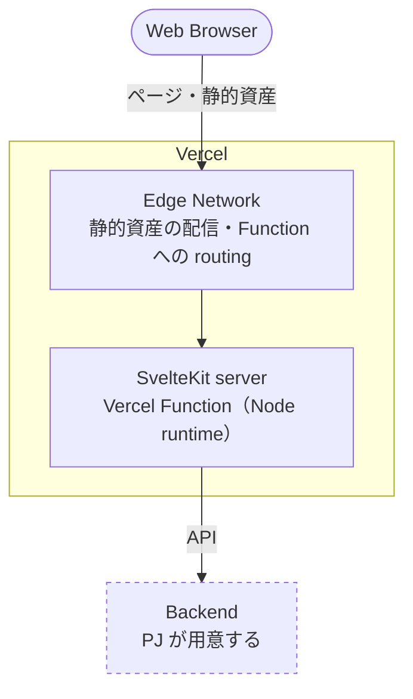
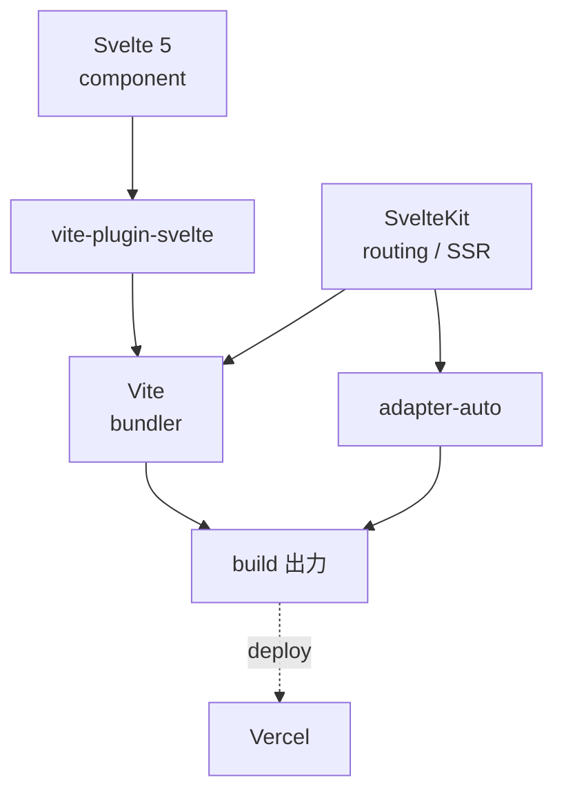
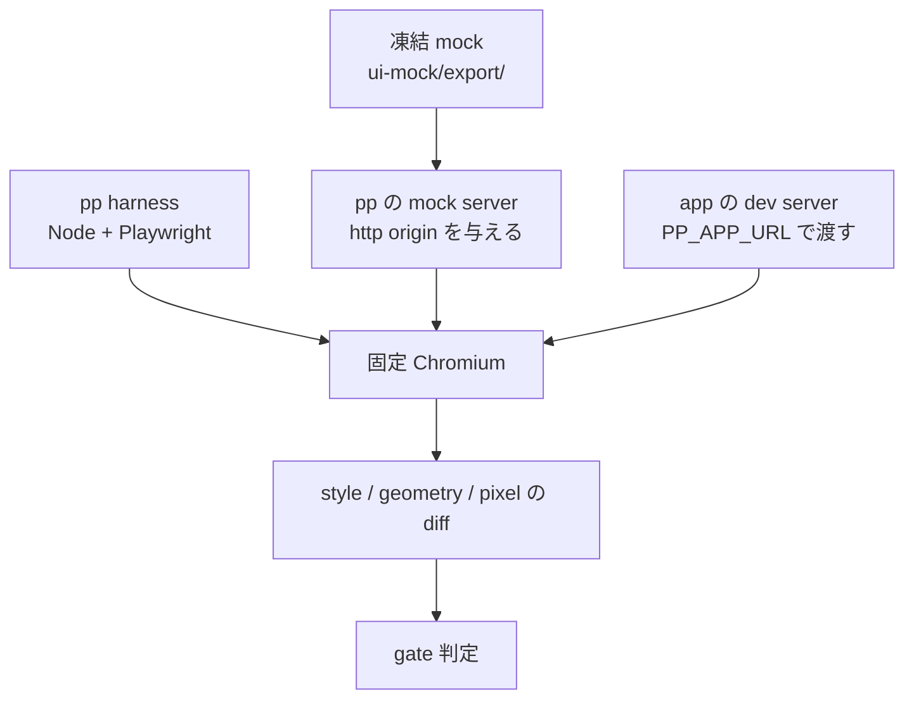

# スタック

構成要素・依存宣言・Node 要件・制約の一覧。

## 実行時の経路

`Vercel` への配線と `Backend` は seed の範囲外（`README.md`「仕組み」の Phase 4）。この図は想定する配置であって、seed が構築するものではない。

## ビルドの経路

矢印は「載る先」を指す。`vite-plugin-svelte` が Svelte を Vite に載せ、`@sveltejs/kit` も Vite plugin として載る。

## 検証の経路

`PP_APP_URL` が未設定なら app 側 spec は skip する（`pp/src/config.ts`）。

## 構成要素

宣言の正本は `frontend/package.json` と `pp/package.json`、解決版の正本は同 dir の `bun.lock`。

| 要素 | 宣言 | 解決版 | 役割 |
|---|---|---|---|
| `svelte` | `^5.56.10` | 5.56.10 | component |
| `@sveltejs/vite-plugin-svelte` | `^7.3.0` | 7.3.0 | Svelte を Vite に載せる。`svelte.config.js` の `preprocess: vitePreprocess()` が呼び出し点 |
| `vite` | `^8.2.2` | 8.2.2 | bundler・dev server |
| `@sveltejs/kit` | `^2.70.3` | 2.70.3 | routing・SSR/prerender・`$app/*`。Vite plugin として動く |
| `@sveltejs/adapter-auto` | `^7.0.1` | 7.0.1 | deploy 先を build 時に解決する。`svelte.config.js` の `kit.adapter` が呼び出し点 |
| `typescript` | `~5.9.3` | 5.9.3 | 型検査 |
| `@playwright/test` | `1.61.1`（range でなく固定） | 1.61.1 | 検証。同梱 Chromium が pixel の出所 |

seed が持たない依存物:

| 対象 | 扱い |
|---|---|
| `bun` | 版を固定しない（`seed-docs/walking-skeleton.md`）。依存導入と script 実行に使う |
| Playwright の browser 実体 | `PLAYWRIGHT_BROWSERS_PATH` 配下に別途取得する。置き場は `tools/toolchain-dir` が決める |
| Vercel | deploy 先。配線は seed の範囲外 |
| Backend | PJ の API。検証中は `pp/src/fixtures/` が応答する |
| pp の mock server | `pp/src/mock-server.ts`。凍結 mock に http origin を与える（`file://` では fetch と dynamic import が壊れる） |

## 依存宣言

`@sveltejs/kit` 2.70.3 の `peerDependencies`。

| 対象 | 許容 range | optional |
|---|---|---|
| `vite` | `^5.0.3 \|\| ^6.0.0 \|\| ^7.0.0-beta.0 \|\| ^8.0.0` | いいえ |
| `svelte` | `^4.0.0 \|\| ^5.0.0-next.0` | いいえ |
| `@sveltejs/vite-plugin-svelte` | `^3.0.0 \|\| ^4.0.0-next.1 \|\| ^5.0.0 \|\| ^6.0.0-next.0 \|\| ^7.0.0` | いいえ |
| `typescript` | `^5.3.3 \|\| ^6.0.0` | はい |
| `@opentelemetry/api` | `^1.0.0` | はい |

`@sveltejs/vite-plugin-svelte` 7.3.0 の `peerDependencies`: `vite: ^8.0.0-beta.7 \|\| ^8.0.0`、`svelte: ^5.46.4`。

## Node

| 要求元 | `engines.node` |
|---|---|
| `vite` 8.2.2 | `^20.19.0 \|\| >=22.12.0` |
| `@sveltejs/vite-plugin-svelte` 7.3.0 | `^20.19 \|\| ^22.12 \|\| >=24` |
| `@sveltejs/kit` 2.70.3 | `>=18.13` |
| `svelte` 5.56.10 | `>=18` |
| `@playwright/test` 1.61.1 | `>=18` |

実効要件は最も狭い `^20.19 || ^22.12 || >=24`。21 は `vite` と `vite-plugin-svelte` の両方が、23 は `vite-plugin-svelte` が除外する。`frontend/package.json`・`pp/package.json` に `engines` の宣言は無く、`.nvmrc` も置いていない。

## 制約

| 制約 | 根拠 | 違反したときの症状 |
|---|---|---|
| `vite` を依存に残す | `@sveltejs/kit` の非 optional peer。kit は `./vite` export の plugin として routing manifest 生成・SSR build・adapter 呼び出しを実装する | SvelteKit が動かない。routing・SSR・`$app/*`・adapter が自作対象になる |
| `@playwright/test` を range でなく固定版で書く | 同梱 Chromium が pixel の出所 | text metrics と anti-aliasing が動き、pixel gate が全面的に赤くなる |
| build と CI の Node 版を揃える | 同一 runtime 内の build は byte 一致する。runtime をまたぐと entry chunk 1 本の minify 識別子が変わり、内容 hash と file 名が変わる（`vite` 8.2.2 での観測。minify は `rolldown` 側で走る） | 成果物 hash が build した環境に依存し、CI と手元で file 名が食い違う |
| `$app/server` の `read()` と `instrumentation.server.js` を使わない | `adapter-auto` の `supports.read` / `supports.instrumentation` が `supports_error()` を throw する | build が落ちる。使うなら具体 adapter へ置き換える |
| deploy runtime は Node に置く | Vercel の Bun Runtime は Beta で、公開ベータ告知が挙げる対象に SvelteKit が無い | 保証範囲外の runtime に本番が乗る |
| 依存の peer range を満たした状態で保つ | 宣言違反の tree は動いても次の解決で別版に化ける | 版が黙って変わる |

`typescript` は kit の optional peer であり、`frontend/package.json` が `~5.9.3` で直接指定している。kit の宣言 range（`^5.3.3 || ^6.0.0`）は解決を左右しないが、range 外の版では kit の型が保証されない。

## deploy 先の解決

`@sveltejs/adapter-auto` 7.0.1 の挙動（`node_modules/@sveltejs/adapter-auto/index.js` と `adapters.js`）。

| 項目 | 内容 |
|---|---|
| host の判定 | build 時に環境変数で判定する（Vercel なら `VERCEL`） |
| 導入する版 | `adapters.js` が host ごとに major を持つ。Vercel は `6` で、`bun add -D @sveltejs/adapter-vercel@6` を `execSync` で実行する |
| 版の記録 | 導入した adapter は `frontend/package.json` にも `bun.lock` にも残らない。major は固定されるが minor と patch は build ごとに動きうる |
| host を判定できないとき | 警告を出し、具体 adapter を解決しない。ローカル build では Vercel 向け出力が出ない |
| 置き換えの勧奨 | auto-install が走った経路でだけ、具体 adapter（`@sveltejs/adapter-vercel`）への置き換えを促す |

## bun と Node の分担

| 対象 | 実行系 |
|---|---|
| `frontend/` と `pp/` の依存導入 | bun（lockfile は `bun.lock`） |
| `frontend/` の build・dev server | Node |
| `pp/` の spec | Node（Playwright） |
| `pp/` の script 起動 | `bun run`。ただし `gate` と `test:*` は内部で `npm test` を呼ぶため npm も要る |

## 出典

deploy runtime の制約は Vercel 側の提供状況に依存する。

| 出典 | 確認日 |
|---|---|
| [Vercel Bun Runtime](https://vercel.com/docs/functions/runtimes/bun)（Beta） | 2026-08-21 |
| [Bun Runtime public beta](https://vercel.com/changelog/bun-runtime-now-in-public-beta-for-vercel-functions)（対象に SvelteKit を含まない） | 2026-08-21 |
| [Vercel Node.js Runtime](https://vercel.com/docs/functions/runtimes/node-js)（`bun.lock` があれば Node runtime でも `bun install` が走る） | 2026-08-21 |
| [adapter-vercel utils.js](https://raw.githubusercontent.com/sveltejs/kit/main/packages/adapter-vercel/utils.js)（`bun1.x` を runtime として扱う） | 2026-08-21 |
| [svelte-adapter-bun README](https://raw.githubusercontent.com/gornostay25/svelte-adapter-bun/main/README.md)（`vite build` を前提とする） | 2026-08-21 |

版を上げる手順は `seed-docs/adoption.md` §7。
